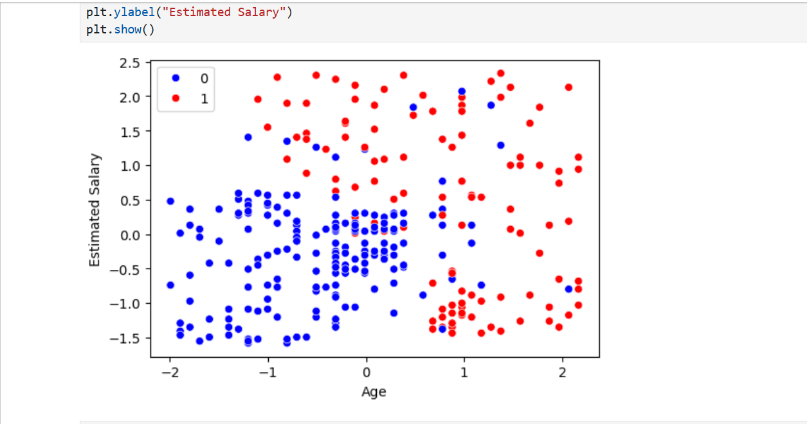
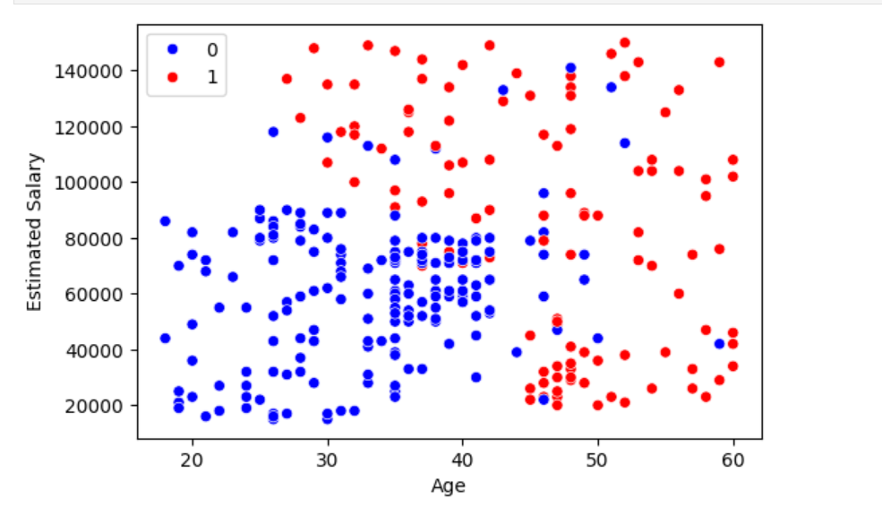
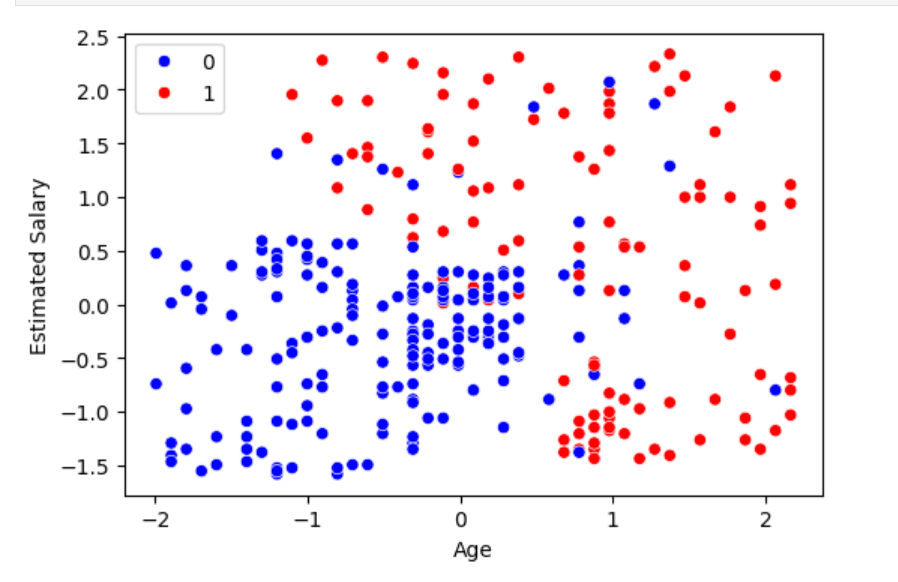
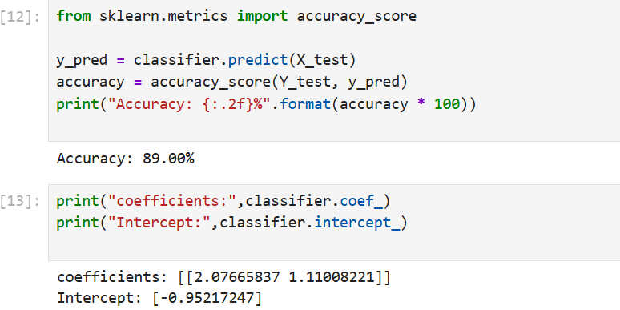

#Logistic regression

## Output Screenshot

Explanation:The plot below shows the decision boundary created by the logistic regression model. 
- Each data point is classified into one of two classes (0 or 1). 

### 2. Scatter plot before scaling  

This shows the scatter plot before scaling the inputs

### 3. Scatter plot after scaling  

This shows the scatter plot after scaling using StandardScaler 

### 4. Accuracy 

